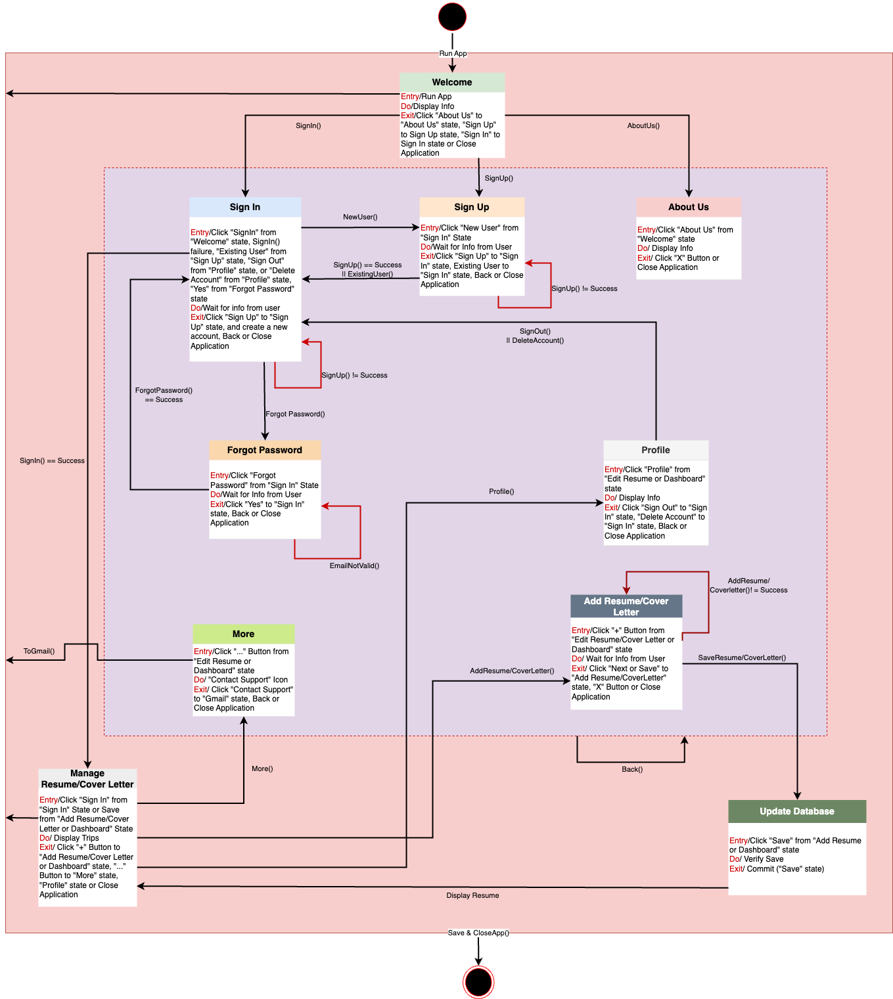

# 📄 ResumeAI – Responsive Employment Solution Using Mobile App

ResumeAI is a mobile-first application that leverages Artificial Intelligence (AI), Firebase cloud storage, and a user-friendly UI to help job seekers quickly generate professional resumes and cover letters. Built using **Jetpack Compose**, **Firebase**, and **Google Gemini AI**, ResumeAI aims to simplify and enhance the job application process.

## 🚀 Purpose

Many job seekers struggle with structuring their resumes, writing impactful cover letters, and optimizing documents for job applications. ResumeAI solves these challenges by offering:

- ✅ AI-generated resume and cover letter content  
- ✅ Real-time grammar and formatting suggestions  
- ✅ Customizable, professional templates  
- ✅ Secure cloud storage for editing and retrieval  
- ✅ Export support for PDF and DOCX formats

## 🎯 Objectives

- **User-Friendly Design**: Built with Jetpack Compose and XML for an intuitive mobile interface  
- **AI-Enhanced Writing**: Generate resumes and cover letters tailored to specific job roles  
- **Template Customization**: Choose from industry-standard layouts  
- **Cloud-Based Storage**: Securely store documents with Firebase  
- **Job Description Analysis**: Tailor documents to ATS using keyword extraction  
- **Grammar & Structure Feedback**: Real-time suggestions for document polish  
- **Multi-Format Export**: Easily export documents in PDF and DOCX formats

## 🛠️ Technologies Used

- **Android Studio**
- **Jetpack Compose + XML**
- **Google Firebase (Authentication & Storage)**
- **Google Gemini AI**
- **Adobe XD (UI/UX Design)**
- **Draw.io (FSM and HTA modeling)**
- **Kotlin (primary language)**

## 🧠 Software Engineering Principles

## 🧠 Software Engineering Principles

- **Agile Scrum Approach**: Iterative development using sprints  

- **Hierarchical Task Analysis (HTA)**: Decomposed tasks for design clarity  
    
    
  
  

- **Finite State Machine (FSM)**: Used to model app navigation and user flow   
  

- **Graphical User Interface Prototyping**: Designed using Adobe XD and HTA diagrams


## 📱 Screenshots

> Add screenshots here to demonstrate the app's home screen, resume creation page, and document export.

## ⚙️ Getting Started

1. Clone the repository:
   ```bash
   git clone https://github.com/RajkumarManala1/ResumeAI.git


---

### ✅ **Step 9: Add Firebase Integration Notes**

```markdown
## ☁️ Firebase Integration

- **Firebase Authentication**: User login/registration  
- **Firebase Storage**: Secure cloud-based document storage and sync  
- **Realtime Database/Firestore** (optional for version history, metadata)


## 👤 Author

**Raj Kumar Manala**  
Faculty Advisor: Dr. Victor Govindaswamy  
Email: crf_manalar@cuchicago.edu  
Concordia University Chicago

---

## 🙌 Acknowledgments

- Bioinformatics And Technology Laboratory (BAT Lab)  
- Mobile Application Implementation and Design Group (MAID)  
- CSC Program at Concordia University Chicago

